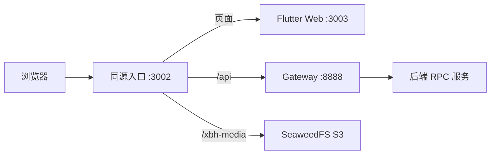

# 小白盒

小白盒是一个以内容为中心的社区项目：用户可以创作、讨论和收藏帖子，通过关注流、搜索与推荐发现
内容，也可以在消息页使用小白盒 Agent 澄清复杂需求、检索资料并获得带来源的综合回答。

本仓库 `little-white-box` 是前后端的联调编排入口，管理本地开发栈、跨仓检查、黑盒测试及两个子仓的
固定版本。业务代码分别维护在独立的 Go 后端与 Flutter 前端仓库中。

[界面预览](#界面预览) · [仓库与架构](#仓库与架构) · [快速开始](#快速开始) · [常用命令](#常用命令) · [开发与文档](#开发与文档)

## 界面预览

以下复用 2026-09-06 上一轮浏览器截图。Mock 使用演示数据，真实联调图来自本地测试栈；均不是生产
数据或当前版本的完整验收结论。图片保存在前端仓，并通过固定提交复用，详见
[截图来源与说明](https://github.com/3219378872/little-white-box-front/blob/93997279f298fa27244098baec7313584509148a/docs/assets/screenshots/README.md)。

### 桌面内容流 · Mock


### 移动端

依次为：暗色搜索结果（Mock）、Agent 澄清问答（Mock）、帖子详情（真实联调）。窄屏下图片依次换行。

<p>
  
  
  
</p>

## 项目介绍

| 方向 | 内容 |
| --- | --- |
| 社区创作与互动 | 帖子草稿与发布、媒体、评论、点赞、收藏、公开资料、关注关系及一对一私信 |
| 内容发现 | 独立的关注流、帖子/用户/标签搜索、个性化与冷启动推荐 |
| 社区助手 | 消息页固定 Agent 线程、结构化澄清、社区优先检索、授权后的互联网补充、来源引用、个人记忆与 Watch 条件追踪 |

内容社区是产品主体，普通搜索、推荐与社区操作不以使用 Agent 为前提。Agent 是帮助用户使用社区的
工具，不是独立通用陪伴产品；使用前需要授权，资料不足、外部服务故障与结论限制应明确呈现。

## 仓库与架构

| 仓库 | 本地位置 | 职责与入口 |
| --- | --- | --- |
| [little-white-box](https://github.com/3219378872/little-white-box) | 当前目录 | 本地栈、跨仓校验、黑盒测试；命令入口为 `justfile` |
| [little-white-box-content-community](https://github.com/3219378872/little-white-box-content-community) | `little-white-box-content-community/` | Go / go-zero 服务、公开 REST 与内部 RPC 契约；命令入口为 `Makefile` |
| [little-white-box-front](https://github.com/3219378872/little-white-box-front) | `little-white-box-front/` | Flutter 客户端、Mock API 与 Dart SDK 集成；命令入口为 `Makefile` |

本地 Web 联调的默认拓扑如下；完整后端服务分工见后端 README。



`:3002` 同时提供页面、API 与媒体入口；`:3003` 默认承载 release 静态包，不是 API 反向代理。
根仓只记录子仓 gitlink，不接管子仓源文件。公开 REST 和 Flutter SDK 的生成源是后端
`app/gateway/gateway.api`；后端 `.proto` 只定义内部 RPC。两份 Dart SDK 的同步由前端仓工具完成。

## 快速开始

### 克隆工作区

需要 Git，并已配置对三个仓库的 GitHub SSH 访问权限。子仓 URL 也使用 SSH。

```bash
git clone --recurse-submodules git@github.com:3219378872/little-white-box.git
cd little-white-box
```

已有检出但尚未初始化子仓时，在根目录运行 `git submodule update --init --recursive`。
该命令检出根仓记录的版本；日常联调不要用 `--remote` 绕过固定 gitlink。

### 路径一：仅体验前端 Mock

准备 Make 与启用 Web 支持的 Flutter SDK，Dart 版本须满足前端 `pubspec.yaml`。以下命令从工作区
根目录运行，不需要 Go 后端、中间件或模型凭据：

```bash
make -C little-white-box-front setup
make -C little-white-box-front dev
```

在本机访问 `http://127.0.0.1:3000`。端口被占用时，例如使用
`make -C little-white-box-front dev PORT=8080`。Mock 的测试身份、后台预览和调试注意事项见
[前端 README](https://github.com/3219378872/little-white-box-front#快速开始)。
Mock 只用于客户端开发，不证明真实 API、模型或推荐效果可用。

### 路径二：完整本地联调

当前编排以 Linux / Bash 为基准，使用 Docker host 网络、`flock`、`setsid` 等本机能力。
它不是零配置安装入口，启动前需具备以下条件：

| 前提 | 要求 |
| --- | --- |
| 工具 | Git、Just、Make、Go、Flutter、Python 3（含 venv/pip）、curl 及 Linux 常用命令 |
| 版本 | Go 以后端 `go.mod` 为准；Flutter/Dart 以客户端依赖声明和锁文件为准 |
| Docker | 可访问 Docker daemon，Docker Compose ≥ 2.24；本地覆盖使用 `ports: !override` |
| 配置与凭据 | 已准备匹配当前服务配置的数据库、缓存、鉴权和外部服务环境变量 |
| 网络与端口 | 能获取依赖及容器镜像，默认联调端口无冲突 |

本地环境文件放在 `/tmp/xbh-dev.env` 或 `deploy/dev/.env`，前者优先；加载时收紧为 `0600`，均不得
入库。凭据通过安全渠道单独配置，不从 README、历史日志或生产示例复制真实密钥。
根仓目前不提供开发环境模板；后端生产环境示例不能直接作为本地配置使用。先核对
[本地联调说明](deploy/dev/README.md)及当前服务 YAML，配置齐备后再在根目录运行：

```bash
just up
just status
```

访问 `http://127.0.0.1:3002`。`just up` 会先停止已有应用，再重放数据库补丁、准备测试数据并启动
当前源码版本的服务；它会改变本地运行状态与数据，不是只读检查。就绪检查也受已配置外部服务影响。
不要把该开发栈直接用于生产环境。

可选 embedding 与在线推理链路需显式 `just infer-up`，首次启动可能下载模型权重。
`just up` 不启动也不停止该链路；未启动时推荐可走规则降级。

## 常用命令

以下命令均从根目录运行；完整列表用 `just --list` 查看。

| 命令 | 用途与边界 |
| --- | --- |
| `just up` / `just down` | 启动或停止本地栈；`down` 同时停止可选算法容器，保留数据卷 |
| `just status` | 查看容器、进程、就绪标记和关键端口，不等同于端到端业务验收 |
| `just app-up` / `just app-down` | 只控制本机应用与反代，分步使用前先确认配置和中间件状态 |
| `just infer-up` / `just infer-down` | 控制可选算法服务 |
| `just knowledge-setup` | 为三仓安装隔离的知识工具依赖，首次知识/契约检查前执行 |
| `just knowledge-check` | 只读核对 gitlink、跨仓知识引用与两端知识门禁 |
| `just contract-check` | 在临时 clone 中检查后端生成漂移，并核对前端两份 SDK；需备齐生成工具 |
| `just e2e deploy/dev/e2e/test_health.py` | 对已运行的真实栈执行所选健康测试；`just e2e` 才运行全套 |

黑盒测试需要其 [Python 依赖](deploy/dev/e2e/requirements.txt)和本地配置。全套测试可能创建测试数据、
调用已配置的外部服务；确定性 Agent fixture 有独立入口与恢复逻辑，不应当作只读文档检查运行。
日志、测试账号、迁移和更完整的操作说明见 [本地联调](deploy/dev/README.md)。

## 开发与文档

| 需要了解 | 入口 |
| --- | --- |
| 工作区规则、仓库归属与提交流程 | [AGENTS.md](AGENTS.md) |
| 稳定联调操作、端口、数据与权限 | [本地联调](deploy/dev/README.md) |
| 启动或联调排障的现场记录 | [NOTES.md](NOTES.md)，其中旧记录不代表当前事实 |
| 后端产品要求、设计与实现状态 | [后端知识总路由](https://github.com/3219378872/little-white-box-content-community/blob/main/docs/knowledge/README.md) |
| 客户端产品要求、设计与实现状态 | [前端知识总路由](https://github.com/3219378872/little-white-box-front/blob/main/docs/knowledge/README.md) |
| 必须结合三仓版本解释的联调证据 | [根仓证据说明](deploy/dev/e2e/evidence/README.md) |

README 的能力概览不是逐条验收结论。真实模型质量、推荐效果、浏览器/设备验证和生产 SLO 各有独立
门禁，不能由 Mock、知识校验通过或某次历史测试结果推断。当前状态以子仓实现映射及其有效证据为准。

修改前先读所属仓库 `AGENTS.md`。两端分别完成工作树、验证与提交，根仓再更新 gitlink；不要在根仓
提交子仓文件，也不要把 README 当成替代正式知识链的第二份规则。
